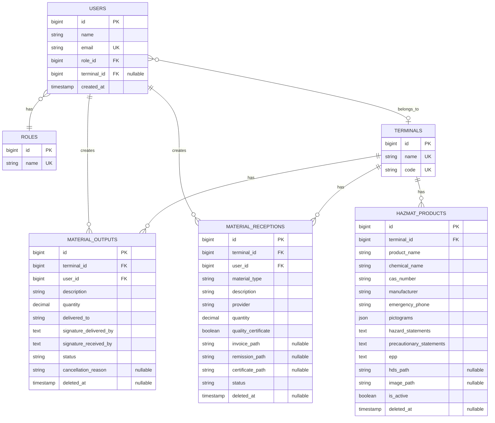

# Documento Técnico para Revisión de TI/Ciberseguridad
## Sistema de Gestión de Procesos de Almacén (SGP-Web)

**Fecha**: Diciembre 2025  
**Versión**: 1.0.0  
**Solicitante**: Coordinación de Materiales  
**Departamento**: Almacén - Terminales TRP y TRVM  

---

## 📋 Índice

1. [Resumen Ejecutivo](#1-resumen-ejecutivo)
2. [Justificación del Proyecto](#2-justificación-del-proyecto)
3. [Funcionalidades del Sistema](#3-funcionalidades-del-sistema)
4. [Aspectos Técnicos](#4-aspectos-técnicos)
5. [Seguridad y Cumplimiento](#5-seguridad-y-cumplimiento)
6. [Infraestructura y Despliegue](#6-infraestructura-y-despliegue)
7. [Escalabilidad y Roadmap](#7-escalabilidad-y-roadmap)
8. [Riesgos y Mitigaciones](#8-riesgos-y-mitigaciones)
9. [Requerimientos para Producción](#9-requerimientos-para-producción)
10. [Conclusiones y Recomendaciones](#10-conclusiones-y-recomendaciones)

---

## 1. Resumen Ejecutivo

### 1.1 Descripción General

SGP-Web es un sistema web interno desarrollado para digitalizar y controlar los procesos operativos diarios del almacén en las terminales TRP y TRVM. **No sustituye a SAP**, sino que lo complementa eliminando el uso de papel, asegurando trazabilidad de firmas digitales, y gestionando documentos regulatorios.

### 1.2 Objetivos del Sistema

| Objetivo | Descripción |
|----------|-------------|
| **Digitalización** | Eliminar formatos en papel para salidas, entradas y materiales peligrosos |
| **Trazabilidad** | Registro digital de firmas y documentos con timestamp |
| **Cumplimiento Normativo** | Gestión de materiales peligrosos según NOM-018-STPS-2015 |
| **Eficiencia Operativa** | Reducir tiempo de registro y búsqueda de información |
| **Auditoría** | Historial completo de movimientos con soft deletes |

### 1.3 Alcance Actual

- ✅ Módulo de Salidas de Material
- ✅ Módulo de Recepciones de Material  
- ✅ Módulo de Materiales Peligrosos (Hazmat)
- ✅ Dashboard Ejecutivo con KPIs
- ✅ Sistema de Roles y Permisos
- ✅ Generación de PDFs y Reportes Excel
- ✅ Análisis de HDS con Inteligencia Artificial

---

## 2. Justificación del Proyecto

### 2.1 Problemática Actual

**Antes del SGP-Web:**

1. **Salidas de Material**:
   - Vales en papel que se extravían
   - Firmas manuscritas sin respaldo digital
   - Difícil búsqueda de registros históricos
   - No hay trazabilidad de quién autorizó cada salida

2. **Recepciones de Material**:
   - Facturas, remisiones y certificados en archivos físicos dispersos
   - Pérdida de documentos regulatorios
   - Imposible buscar recepciones por proveedor o fecha

3. **Materiales Peligrosos**:
   - **No existía control formal** de materiales peligrosos
   - HDS (Hojas de Datos de Seguridad) en carpetas físicas
   - Incumplimiento de NOM-018-STPS-2015
   - Riesgo de sanciones por autoridades

### 2.2 Beneficios Esperados

| Beneficio | Impacto |
|-----------|---------|
| **Reducción de papel** | -90% en formatos impresos |
| **Tiempo de búsqueda** | De 15 minutos a 10 segundos |
| **Cumplimiento normativo** | 100% en NOM-018-STPS-2015 |
| **Trazabilidad** | Auditoría completa de movimientos |
| **Eficiencia** | -30% tiempo en registro de operaciones |

### 2.3 Relación con SAP

> **IMPORTANTE**: SGP-Web **NO** reemplaza a SAP. SAP sigue siendo el sistema oficial para inventario fiscal y contabilidad.

**División de Responsabilidades:**

| Sistema | Responsabilidad |
|---------|-----------------|
| **SAP** | Inventario fiscal, contabilidad, órdenes de compra, valuación |
| **SGP-Web** | Control operativo diario, trazabilidad, documentos regulatorios, firmas digitales |

**Flujo de Trabajo:**
1. Material llega → Se registra en **SGP-Web** (con documentos adjuntos)
2. Se asigna ubicación → Se actualiza en **SGP-Web**
3. Se captura en **SAP** (inventario fiscal)
4. Material sale → Se registra en **SGP-Web** (con firmas digitales)
5. Se descarga en **SAP** (inventario fiscal)

---

## 3. Funcionalidades del Sistema

### 3.1 Módulo de Salidas (Material Outputs)

**Objetivo**: Registrar qué material sale del almacén y quién se lo lleva.

**Características**:
- ✅ Formulario de registro con datos del solicitante
- ✅ **Firmas digitales** (Canvas HTML5) de quien entrega y quien recibe
- ✅ Generación automática de **Vale de Salida en PDF**
- ✅ Estados del proceso: `PENDIENTE_OT` → `PENDIENTE_SAP` → `COMPLETO`
- ✅ Edición posterior para agregar folio SAP u OT
- ✅ Exportación a Excel con filtros
- ✅ Cancelación con motivo obligatorio (soft delete)

**Flujo de Trabajo**:
```
1. Usuario registra salida → Estado: PENDIENTE_OT
2. Se genera OT → Se actualiza folio OT → Estado: PENDIENTE_SAP
3. Se captura en SAP → Se actualiza folio SAP → Estado: COMPLETO
```

**Seguridad**:
- Solo usuarios con rol `Administrador` o `Mantenimiento` pueden crear salidas
- Las firmas se guardan en Base64 en la base de datos
- Los registros nunca se eliminan físicamente (soft deletes)

---

### 3.2 Módulo de Recepciones (Material Receptions)

**Objetivo**: Registrar material que llega de proveedores con documentación completa.

**Características**:
- ✅ Formulario de registro con datos del proveedor
- ✅ **Subida de archivos PDF**: Factura, Remisión, Certificado de Calidad
- ✅ Campo condicional de certificado (solo si aplica)
- ✅ Generación de **Vale de Entrada en PDF**
- ✅ Estados: `PENDIENTE_UBICACION` → `COMPLETO`
- ✅ Visualización de archivos adjuntos desde el index
- ✅ Filtros por mes, año, terminal, búsqueda
- ✅ Exportación a Excel

**Flujo de Trabajo**:
```
1. Material llega → Se registra recepción → Estado: PENDIENTE_UBICACION
2. Se asigna ubicación física → Estado: COMPLETO
3. Se captura en SAP (inventario fiscal)
```

**Seguridad**:
- Validación de tipos MIME (solo PDFs)
- Límite de tamaño: 10MB por archivo
- Archivos almacenados fuera del directorio público
- Rutas protegidas con middleware de autenticación

---

### 3.3 Módulo Hazmat (Materiales Peligrosos) ⚠️

**Objetivo**: Cumplir con la NOM-018-STPS-2015 para manejo de sustancias químicas peligrosas.

**Características Principales**:

#### 3.3.1 Análisis con Inteligencia Artificial 🤖
- **Integración con Google Gemini 2.5 Flash**
- El usuario sube la HDS (Hoja de Datos de Seguridad) en PDF
- La IA extrae automáticamente:
  - Nombre químico y comercial
  - Número CAS
  - Fabricante y teléfono de emergencia
  - Códigos H (Indicaciones de Peligro)
  - Códigos P (Consejos de Prudencia)
  - Pictogramas GHS aplicables
  - EPP (Equipo de Protección Personal) recomendado
- El formulario se autocompleta con esta información
- **Ahorro de tiempo**: De 20 minutos a 2 minutos por producto

#### 3.3.2 Generación de Etiquetas GHS
- Etiquetas en formato PDF tamaño carta (landscape)
- Diseño oficial según NOM-018-STPS-2015:
  - Borde rojo de seguridad
  - Pictogramas GHS (rombos rojos)
  - Palabra de advertencia (PELIGRO/ATENCIÓN)
  - Frases H y P
  - EPP recomendado
  - Datos del fabricante
  - Teléfono de emergencia 24h
- Listas para imprimir y colocar en contenedores

#### 3.3.3 Listado Maestro
- Filtros por terminal, estado físico, palabra de advertencia
- Visualización de pictogramas con emojis
- Semáforos de estatus (Activo/Inactivo)
- Exportación a Excel
- Acceso a HDS almacenada

**Cumplimiento Normativo**:
- ✅ NOM-018-STPS-2015 (Identificación de peligros)
- ✅ Sistema Globalmente Armonizado (GHS)
- ✅ Trazabilidad de HDS actualizadas
- ✅ Etiquetado correcto de contenedores

---

### 3.4 Dashboard Ejecutivo

**KPIs Visualizados**:
- 📊 Total de salidas del mes actual
- 📊 Total de recepciones del mes actual
- 📊 Materiales peligrosos activos
- 📊 Movimientos pendientes de completar

**Gráficas (Chart.js)**:
- Barras: Movimientos de los últimos 6 meses
- Dona: Materiales peligrosos por estado físico (Líquido, Sólido, Gas)

**Tablas Resumen**:
- Últimas 5 salidas
- Últimas 5 recepciones
- Materiales peligrosos recién agregados

---

### 3.5 Sistema de Roles y Permisos

| Rol | Acceso |
|-----|--------|
| **Administrador** | CRUD completo en todos los módulos, gestión de usuarios |
| **Gerencia** | Solo lectura en reportes y dashboards |
| **Mantenimiento** | Solo módulo de Salidas (crear, editar, ver) |
| **Seguridad y Salud** | Solo módulo Hazmat (crear, editar, ver) |

**Implementación**:
- Middleware personalizado `RoleMiddleware`
- Validación en rutas con `->middleware('role:Administrador,Gerencia')`
- Validación adicional en controladores para operaciones sensibles

---

## 4. Aspectos Técnicos

### 4.1 Stack Tecnológico

#### Backend
- **Framework**: Laravel 12.0 (PHP 8.3)
- **ORM**: Eloquent
- **Autenticación**: Laravel Breeze
- **Generación de PDFs**: DomPDF 3.1
- **Exportación Excel**: Maatwebsite Excel 3.1
- **IA**: Google Gemini 2.5 Flash API

#### Frontend
- **Motor de Plantillas**: Blade
- **CSS Framework**: Tailwind CSS 3.x
- **JavaScript**: Alpine.js (interactividad ligera)
- **Gráficas**: Chart.js
- **Firmas Digitales**: Signature Pad (Canvas HTML5)

#### Base de Datos
- **Motor**: PostgreSQL 16
- **Hosting**: Neon.tech (actualmente)
- **Migraciones**: Laravel Migrations
- **Seeders**: Datos iniciales (terminales, roles, usuario admin)

#### Infraestructura Actual
- **Containerización**: Docker (Apache + PHP 8.3)
- **Hosting**: Render.com (plan gratuito)
- **Almacenamiento**: Disco local (simulado en Render)

> **⚠️ NOTA IMPORTANTE**: El almacenamiento en Render es **efímero**. Si el contenedor se reinicia, los archivos se pierden. Se recomienda migrar a Azure Blob Storage o AWS S3 para producción.

---

### 4.2 Arquitectura del Sistema

#### 4.2.1 Patrón de Diseño
- **Arquitectura**: Monolítica MVC (Model-View-Controller)
- **Ventajas**:
  - Simplicidad en desarrollo y mantenimiento
  - Menor complejidad de infraestructura
  - Ideal para equipos pequeños
  - Despliegue sencillo

#### 4.2.2 Estructura de Capas

```
┌─────────────────────────────────────┐
│         Capa de Presentación        │
│   (Blade Templates + Alpine.js)     │
└──────────────┬──────────────────────┘
               │
┌──────────────▼──────────────────────┐
│        Capa de Controladores        │
│  (MaterialOutputController, etc.)   │
└──────────────┬──────────────────────┘
               │
┌──────────────▼──────────────────────┐
│         Capa de Servicios           │
│      (GeminiService, etc.)          │
└──────────────┬──────────────────────┘
               │
┌──────────────▼──────────────────────┐
│         Capa de Modelos             │
│  (User, MaterialOutput, Hazmat)     │
└──────────────┬──────────────────────┘
               │
┌──────────────▼──────────────────────┐
│        Base de Datos (PostgreSQL)   │
└─────────────────────────────────────┘
```

#### 4.2.3 Multi-Tenant Lógico

El sistema maneja múltiples terminales (TRP, TRVM) en una sola base de datos:

- **Tabla `terminals`**: Catálogo de terminales
- **Tabla `users`**: Cada usuario pertenece a una terminal (o NULL para SuperAdmin)
- **Filtrado automático**: Los usuarios solo ven datos de su terminal
- **SuperAdmin**: Puede ver todas las terminales

---

### 4.3 Base de Datos

#### 4.3.1 Diagrama de Relaciones (ERD)



#### 4.3.2 Índices y Optimizaciones

**Índices Implementados**:
- Primary Keys en todas las tablas
- Unique constraints en emails, códigos de terminal
- Foreign keys con `onDelete('cascade')` donde aplica
- Índices en campos de búsqueda frecuente (status, terminal_id)

**Soft Deletes**:
- Todas las tablas principales usan `deleted_at`
- Los registros nunca se eliminan físicamente
- Permite auditoría histórica completa

---

## 5. Seguridad y Cumplimiento

### 5.1 Medidas de Seguridad Implementadas

#### 5.1.1 Autenticación y Sesiones
- ✅ Laravel Breeze (autenticación oficial)
- ✅ Hashing de contraseñas con Bcrypt (cost factor 12)
- ✅ Sesiones seguras con cookies HTTP-only
- ✅ Regeneración de session ID después del login
- ✅ Logout con invalidación de sesión

#### 5.1.2 Autorización
- ✅ Middleware de roles personalizado
- ✅ Control de acceso basado en roles (RBAC)
- ✅ Validación de permisos en cada ruta
- ✅ Validación adicional en controladores
- ✅ Usuarios solo ven datos de su terminal

#### 5.1.3 Protección contra Vulnerabilidades

| Vulnerabilidad | Mitigación |
|----------------|------------|
| **SQL Injection** | Eloquent ORM con prepared statements |
| **XSS** | Blade escaping automático `{{ }}` |
| **CSRF** | Token CSRF en todos los formularios |
| **Mass Assignment** | `$fillable` en todos los modelos |
| **File Upload** | Validación de MIME types y tamaño |
| **Path Traversal** | Rutas protegidas con middleware |
| **Session Fixation** | Regeneración de session ID |

#### 5.1.4 Validación de Datos
- ✅ Validación server-side en todos los formularios
- ✅ Sanitización de inputs
- ✅ Reglas de validación estrictas
- ✅ Mensajes de error personalizados

#### 5.1.5 Manejo de Archivos
- ✅ Validación de tipos MIME (solo PDF para documentos, PNG/JPG para imágenes)
- ✅ Límites de tamaño (10MB para PDFs, 5MB para imágenes)
- ✅ Almacenamiento fuera del directorio público (`storage/app/public`)
- ✅ Rutas protegidas con middleware de autenticación
- ✅ Nombres de archivo únicos (hash)

#### 5.1.6 Logging y Auditoría
- ✅ Logs de Laravel en `storage/logs/laravel.log`
- ✅ Registro de errores con stack trace
- ✅ Soft deletes con motivo de cancelación
- ✅ Timestamps en todas las tablas (created_at, updated_at)

### 5.2 Recomendaciones de Seguridad Adicionales

Para producción, se recomienda implementar:

1. **HTTPS Obligatorio**
   - Certificado SSL/TLS válido
   - Redirección automática HTTP → HTTPS
   - HSTS (HTTP Strict Transport Security)

2. **Firewall y Red**
   - Limitar acceso a puerto 22 (SSH) solo desde IPs corporativas
   - Limitar acceso a puerto 5432 (PostgreSQL) solo desde servidor web
   - Implementar WAF (Web Application Firewall)

3. **Rate Limiting**
   - Limitar intentos de login (5 intentos / 5 minutos)
   - Limitar requests a API de IA (10 requests / minuto)
   - Throttling en rutas públicas

4. **Backups**
   - Backup automático diario de base de datos
   - Backup semanal de archivos adjuntos
   - Retención de 30 días
   - Pruebas de restauración mensuales

5. **Monitoreo**
   - Implementar Sentry o Bugsnag para tracking de errores
   - Alertas de errores críticos por email
   - Monitoreo de uptime (UptimeRobot, Pingdom)
   - Logs de acceso y auditoría

6. **Actualizaciones**
   - Actualizar Laravel y dependencias mensualmente
   - Revisar security advisories de Composer
   - Aplicar parches de seguridad de PHP

7. **Políticas de Contraseñas**
   - Mínimo 8 caracteres
   - Requerir mayúsculas, minúsculas, números
   - Expiración de contraseñas cada 90 días
   - Prevenir reutilización de últimas 5 contraseñas

### 5.3 Cumplimiento Normativo

#### NOM-018-STPS-2015
- ✅ Identificación de peligros y riesgos por sustancias químicas
- ✅ Etiquetado según Sistema Globalmente Armonizado (GHS)
- ✅ Hojas de Datos de Seguridad almacenadas y accesibles
- ✅ Registro de materiales peligrosos en el centro de trabajo

#### GDPR / Protección de Datos Personales (si aplica)
- ✅ Almacenamiento seguro de datos personales
- ✅ Encriptación de contraseñas
- ✅ Derecho al olvido (soft deletes)
- ✅ Logs de acceso a datos sensibles

---

## 6. Infraestructura y Despliegue

### 6.1 Infraestructura Actual (Desarrollo/Pruebas)

**Hosting**: Render.com (Plan Gratuito)
- **Ventajas**: Despliegue automático desde Git, HTTPS gratuito
- **Desventajas**: Contenedor efímero, se reinicia cada 15 min de inactividad

**Base de Datos**: Neon.tech (PostgreSQL serverless)
- **Ventajas**: Escalado automático, backups incluidos
- **Desventajas**: Límite de 10GB en plan gratuito

**Almacenamiento**: Disco local del contenedor
- **⚠️ PROBLEMA**: Los archivos se pierden al reiniciar el contenedor

### 6.2 Infraestructura Recomendada para Producción

#### Opción 1: Servidor On-Premise (Recomendado para Datos Sensibles)

```
┌─────────────────────────────────────────┐
│     Servidor Físico / VM                │
│  - Ubuntu Server 22.04 LTS              │
│  - 4 CPU cores, 8GB RAM, 100GB SSD      │
│  - Nginx + PHP-FPM 8.3                  │
│  - PostgreSQL 16                        │
│  - Backup diario a NAS corporativo      │
└─────────────────────────────────────────┘
```

**Ventajas**:
- Control total de datos
- Sin costos recurrentes de cloud
- Cumplimiento de políticas de seguridad corporativas
- Integración con Active Directory

**Desventajas**:
- Requiere equipo de IT para mantenimiento
- Responsabilidad de backups y seguridad

#### Opción 2: Azure App Service (Cloud Híbrido)

```
┌─────────────────────────────────────────┐
│     Azure App Service (B2)              │
│  - PHP 8.3 Runtime                      │
│  - 2 cores, 3.5GB RAM                   │
│  - Auto-scaling                         │
│  - Azure PostgreSQL Flexible Server     │
│  - Azure Blob Storage (archivos)        │
│  - Backup automático                    │
└─────────────────────────────────────────┘
```

**Costo Estimado**: ~$100 USD/mes

**Ventajas**:
- Mantenimiento gestionado por Microsoft
- Escalado automático
- Backups automáticos
- SLA 99.95%

### 6.3 Requerimientos de Servidor

**Mínimos (hasta 50 usuarios concurrentes)**:
- CPU: 2 cores
- RAM: 4GB
- Disco: 50GB SSD
- Ancho de banda: 100 Mbps

**Recomendados (hasta 200 usuarios concurrentes)**:
- CPU: 4 cores
- RAM: 8GB
- Disco: 100GB SSD
- Ancho de banda: 1 Gbps

### 6.4 Proceso de Despliegue

#### Despliegue Manual (Servidor On-Premise)

```bash
# 1. Clonar repositorio
git clone <repo-url> /var/www/sgp-web
cd /var/www/sgp-web

# 2. Instalar dependencias
composer install --optimize-autoloader --no-dev
npm install
npm run build

# 3. Configurar permisos
chown -R www-data:www-data storage bootstrap/cache
chmod -R 775 storage bootstrap/cache

# 4. Configurar .env
cp .env.example .env
php artisan key:generate

# 5. Ejecutar migraciones
php artisan migrate --force

# 6. Optimizar para producción
php artisan config:cache
php artisan route:cache
php artisan view:cache
php artisan optimize

# 7. Crear symlink de storage
php artisan storage:link
```

#### Despliegue Automático (CI/CD)

Se puede configurar GitHub Actions o GitLab CI para despliegue automático:

```yaml
# .github/workflows/deploy.yml
name: Deploy to Production
on:
  push:
    branches: [main]
jobs:
  deploy:
    runs-on: ubuntu-latest
    steps:
      - uses: actions/checkout@v2
      - name: Deploy to server
        run: |
          ssh user@server 'cd /var/www/sgp-web && git pull && composer install --no-dev && php artisan migrate --force && php artisan optimize'
```

---

## 7. Escalabilidad y Roadmap

### 7.1 Limitaciones Actuales

| Aspecto | Limitación Actual | Impacto |
|---------|-------------------|---------|
| **Inventario** | No lleva stock en tiempo real | Requiere consultar SAP para saber existencias |
| **Integración SAP** | No hay sincronización automática | Doble captura de datos |
| **Notificaciones** | No hay alertas automáticas | Usuarios deben revisar manualmente |
| **Reportes** | Reportes básicos en Excel | Análisis limitado de datos |
| **Movilidad** | Solo acceso web | No hay app móvil |

### 7.2 Roadmap de Desarrollo Futuro

#### Fase 2: Sistema de Inventario (Kardex) - Q1 2026

**Objetivo**: Llevar control de stock en tiempo real de consumibles.

**Funcionalidades**:
- ✅ Tabla `inventory_movements` con tipo (ENTRADA/SALIDA)
- ✅ Cálculo automático de stock actual
- ✅ Alertas de stock mínimo
- ✅ Reportes de consumo por departamento
- ✅ Gráficas de tendencias de consumo
- ✅ Predicción de necesidades de compra

**Beneficios**:
- Reducir faltantes de material
- Optimizar órdenes de compra
- Identificar consumos anormales

**Complejidad**: Media  
**Tiempo Estimado**: 2 meses  
**Recursos**: 1 desarrollador

---

#### Fase 3: Integración con SAP - Q2 2026

**Objetivo**: Sincronización bidireccional con SAP para eliminar doble captura.

**Funcionalidades**:
- ✅ API REST para recibir órdenes de compra desde SAP
- ✅ Webhook para notificar movimientos a SAP
- ✅ Sincronización de maestros de materiales
- ✅ Reconciliación de diferencias

**Arquitectura Propuesta**:
```
SAP (ERP) <---> Middleware (API Gateway) <---> SGP-Web
```

**Beneficios**:
- Eliminar doble captura
- Datos consistentes entre sistemas
- Reducir errores humanos

**Complejidad**: Alta  
**Tiempo Estimado**: 4 meses  
**Recursos**: 1 desarrollador + 1 consultor SAP  
**Costo Estimado**: $50,000 - $100,000 USD

---

#### Fase 4: Notificaciones y Alertas - Q3 2026

**Objetivo**: Automatizar comunicación de eventos importantes.

**Funcionalidades**:
- ✅ Notificaciones por email
- ✅ Alertas de stock mínimo
- ✅ Recordatorios de vencimiento de certificados
- ✅ Recordatorios de actualización de HDS (cada 5 años)
- ✅ Notificaciones de aprobaciones pendientes
- ✅ Resumen semanal de movimientos

**Tecnologías**:
- Laravel Notifications
- Laravel Queue (para envíos asíncronos)
- SendGrid o Amazon SES

**Beneficios**:
- Proactividad en gestión
- Reducir incumplimientos normativos
- Mejorar comunicación entre departamentos

**Complejidad**: Baja  
**Tiempo Estimado**: 1 mes  
**Recursos**: 1 desarrollador

---

#### Fase 5: Reportes Avanzados y Business Intelligence - Q4 2026

**Objetivo**: Análisis profundo de datos para toma de decisiones.

**Funcionalidades**:
- ✅ Dashboard interactivo con filtros dinámicos
- ✅ Reportes personalizables por usuario
- ✅ Exportación a PDF con gráficas
- ✅ Análisis de tendencias (consumo, proveedores, costos)
- ✅ Comparativas entre terminales
- ✅ Indicadores de desempeño (KPIs)

**Tecnologías**:
- Laravel Charts
- Power BI Embedded (opcional)
- Exportación avanzada con PhpSpreadsheet

**Beneficios**:
- Decisiones basadas en datos
- Identificar oportunidades de ahorro
- Benchmarking entre terminales

**Complejidad**: Media  
**Tiempo Estimado**: 2 meses  
**Recursos**: 1 desarrollador

---

#### Fase 6: Aplicación Móvil - Q1 2027

**Objetivo**: Acceso desde dispositivos móviles para operaciones en campo.

**Funcionalidades**:
- ✅ Escaneo de códigos QR/Barras
- ✅ Registro de salidas desde almacén
- ✅ Consulta de inventario en tiempo real
- ✅ Captura de fotos de materiales
- ✅ Modo offline con sincronización

**Tecnologías**:
- Flutter (iOS + Android con un solo código)
- API REST en Laravel
- SQLite local para modo offline

**Beneficios**:
- Agilizar operaciones en campo
- Reducir errores de captura
- Acceso desde cualquier lugar

**Complejidad**: Alta  
**Tiempo Estimado**: 6 meses  
**Recursos**: 1 desarrollador móvil + 1 backend  
**Costo Estimado**: $80,000 - $150,000 USD

---

#### Fase 7: Códigos QR y Trazabilidad Avanzada - Q2 2027

**Objetivo**: Trazabilidad completa con códigos QR.

**Funcionalidades**:
- ✅ Generación de códigos QR para cada material
- ✅ Etiquetas con QR en vales de salida/entrada
- ✅ Escaneo de QR para consultar historial completo
- ✅ Trazabilidad de lote/serie
- ✅ Ubicación en tiempo real

**Beneficios**:
- Trazabilidad end-to-end
- Auditorías más rápidas
- Reducir pérdidas de material

**Complejidad**: Media  
**Tiempo Estimado**: 2 meses  
**Recursos**: 1 desarrollador

---

### 7.3 Escalabilidad Técnica

#### Escalado Horizontal (más servidores)

Si el tráfico crece, el sistema puede escalar horizontalmente:

```
┌─────────────┐
│ Load Balancer│
└──────┬───────┘
       │
   ┌───┴───┬───────┬───────┐
   │       │       │       │
┌──▼──┐ ┌──▼──┐ ┌──▼──┐ ┌──▼──┐
│Web 1│ │Web 2│ │Web 3│ │Web 4│
└──┬──┘ └──┬──┘ └──┬──┘ └──┬──┘
   │       │       │       │
   └───┬───┴───────┴───────┘
       │
   ┌───▼────────┐
   │ PostgreSQL │
   │  (Master)  │
   └────────────┘
```

**Requerimientos**:
- Sesiones en Redis (no en archivos)
- Archivos en storage compartido (S3, Azure Blob)
- Base de datos con replicación

#### Escalado Vertical (servidor más potente)

Para crecimiento moderado, simplemente aumentar recursos del servidor:
- 2 cores → 4 cores → 8 cores
- 4GB RAM → 8GB RAM → 16GB RAM

---

## 8. Riesgos y Mitigaciones

### 8.1 Riesgos Técnicos

| Riesgo | Probabilidad | Impacto | Mitigación |
|--------|--------------|---------|------------|
| **Pérdida de archivos en Render** | Alta | Alto | Migrar a Azure Blob Storage o S3 |
| **Caída de base de datos** | Baja | Alto | Backups diarios automáticos, réplica standby |
| **Saturación de disco** | Media | Medio | Monitoreo de espacio, limpieza de archivos antiguos |
| **Vulnerabilidad de seguridad** | Media | Alto | Actualizaciones mensuales, auditorías de seguridad |
| **Fallo de API de Gemini** | Baja | Bajo | Permitir captura manual si API falla |

### 8.2 Riesgos Operativos

| Riesgo | Probabilidad | Impacto | Mitigación |
|--------|--------------|---------|------------|
| **Resistencia al cambio** | Media | Medio | Capacitación, soporte continuo |
| **Doble captura (SGP + SAP)** | Alta | Medio | Integración automática en Fase 3 |
| **Falta de adopción** | Baja | Alto | Hacer obligatorio el uso, eliminar formatos en papel |
| **Pérdida de conocimiento** | Media | Alto | Documentación completa, capacitación cruzada |

### 8.3 Riesgos de Cumplimiento

| Riesgo | Probabilidad | Impacto | Mitigación |
|--------|--------------|---------|------------|
| **Incumplimiento NOM-018** | Baja | Alto | Auditorías internas trimestrales |
| **Pérdida de HDS** | Baja | Alto | Backups automáticos, almacenamiento redundante |
| **Falta de trazabilidad** | Baja | Medio | Soft deletes, logs de auditoría |

---

## 9. Requerimientos para Producción

### 9.1 Infraestructura

**Servidor Web**:
- [ ] Ubuntu Server 22.04 LTS (o Windows Server 2022)
- [ ] Nginx 1.24+ o Apache 2.4+
- [ ] PHP 8.3 con extensiones requeridas
- [ ] Certificado SSL/TLS válido
- [ ] Firewall configurado

**Base de Datos**:
- [ ] PostgreSQL 16+ en servidor dedicado
- [ ] Backups automáticos diarios
- [ ] Réplica standby (opcional pero recomendado)

**Almacenamiento**:
- [ ] Azure Blob Storage o AWS S3 para archivos
- [ ] Mínimo 100GB de espacio
- [ ] Redundancia geográfica

**Red**:
- [ ] IP estática o dominio corporativo
- [ ] VPN para acceso remoto (opcional)
- [ ] Ancho de banda mínimo 100 Mbps

### 9.2 Seguridad

- [ ] HTTPS obligatorio con redirección automática
- [ ] Firewall configurado (solo puertos 80, 443, 22)
- [ ] Fail2ban para prevenir ataques de fuerza bruta
- [ ] WAF (Web Application Firewall) - opcional
- [ ] Monitoreo de logs de acceso
- [ ] Auditorías de seguridad trimestrales

### 9.3 Backups

- [ ] Backup diario de base de datos (retención 30 días)
- [ ] Backup semanal de archivos adjuntos (retención 90 días)
- [ ] Backup mensual completo (retención 1 año)
- [ ] Pruebas de restauración mensuales
- [ ] Almacenamiento offsite de backups

### 9.4 Monitoreo

- [ ] Uptime monitoring (UptimeRobot, Pingdom)
- [ ] Error tracking (Sentry, Bugsnag)
- [ ] Performance monitoring (New Relic, DataDog)
- [ ] Alertas por email/SMS para incidentes críticos
- [ ] Dashboard de métricas (CPU, RAM, disco, tráfico)

### 9.5 Documentación

- [ ] Manual de usuario final
- [ ] Manual de administrador
- [ ] Procedimientos de backup y restauración
- [ ] Procedimientos de actualización
- [ ] Contactos de soporte

### 9.6 Capacitación

- [ ] Capacitación a usuarios finales (2 horas)
- [ ] Capacitación a administradores (4 horas)
- [ ] Capacitación a equipo de IT (8 horas)
- [ ] Materiales de capacitación (videos, PDFs)

---

## 10. Conclusiones y Recomendaciones

### 10.1 Conclusiones

1. **SGP-Web es un sistema necesario** que digitaliza procesos críticos del almacén, eliminando el uso de papel y asegurando trazabilidad.

2. **Complementa a SAP**, no lo reemplaza. Cada sistema tiene su propósito específico.

3. **Cumple con normativas** como la NOM-018-STPS-2015 para materiales peligrosos.

4. **Tecnología robusta**: Laravel 12 es un framework maduro, seguro y ampliamente usado en la industria.

5. **Escalable**: El diseño permite crecimiento futuro con integraciones, inventario en tiempo real, y app móvil.

6. **Seguridad implementada**: Autenticación, autorización, validación de datos, y protección contra vulnerabilidades comunes.

### 10.2 Recomendaciones para TI/Ciberseguridad

#### Corto Plazo (1-3 meses)

1. **Migrar almacenamiento a Azure Blob Storage o AWS S3**
   - Prioridad: **ALTA**
   - Justificación: Evitar pérdida de archivos en Render

2. **Implementar HTTPS en producción**
   - Prioridad: **ALTA**
   - Justificación: Seguridad de datos en tránsito

3. **Configurar backups automáticos de base de datos**
   - Prioridad: **ALTA**
   - Justificación: Protección contra pérdida de datos

4. **Implementar rate limiting**
   - Prioridad: **MEDIA**
   - Justificación: Prevenir ataques de fuerza bruta

#### Mediano Plazo (3-6 meses)

5. **Migrar a servidor on-premise o Azure App Service**
   - Prioridad: **ALTA**
   - Justificación: Mayor control y confiabilidad

6. **Implementar monitoreo de errores (Sentry)**
   - Prioridad: **MEDIA**
   - Justificación: Detectar problemas proactivamente

7. **Auditoría de seguridad externa**
   - Prioridad: **MEDIA**
   - Justificación: Validar implementaciones de seguridad

8. **Documentar procedimientos de recuperación ante desastres**
   - Prioridad: **MEDIA**
   - Justificación: Preparación para incidentes

#### Largo Plazo (6-12 meses)

9. **Implementar sistema de inventario (Kardex)**
   - Prioridad: **ALTA**
   - Justificación: Maximizar valor del sistema

10. **Integración con SAP**
    - Prioridad: **ALTA**
    - Justificación: Eliminar doble captura

11. **Desarrollar app móvil**
    - Prioridad: **MEDIA**
    - Justificación: Mejorar eficiencia operativa

### 10.3 Aprobación Solicitada

Se solicita la aprobación de TI/Ciberseguridad para:

- ✅ Desplegar SGP-Web en ambiente de producción
- ✅ Asignar recursos de infraestructura (servidor, base de datos, almacenamiento)
- ✅ Configurar accesos y permisos necesarios
- ✅ Incluir en plan de backups corporativo
- ✅ Incluir en plan de monitoreo de aplicaciones

---

## Anexos

### Anexo A: Glosario de Términos

| Término | Definición |
|---------|------------|
| **HDS** | Hoja de Datos de Seguridad (Safety Data Sheet) |
| **GHS** | Sistema Globalmente Armonizado (Globally Harmonized System) |
| **NOM-018-STPS-2015** | Norma Oficial Mexicana para identificación de peligros por sustancias químicas |
| **Soft Delete** | Eliminación lógica (no física) de registros en base de datos |
| **RBAC** | Control de Acceso Basado en Roles (Role-Based Access Control) |
| **ORM** | Object-Relational Mapping (Eloquent en Laravel) |
| **CSRF** | Cross-Site Request Forgery |
| **XSS** | Cross-Site Scripting |

### Anexo B: Contactos

| Rol | Nombre | Email |
|-----|--------|-------|
| **Coordinador de Materiales** | [Tu Nombre] | [tu.email@empresa.com] |
| **Desarrollador** | [Nombre] | [email] |
| **Soporte IT** | [Nombre] | [email] |

### Anexo C: Referencias

- [Laravel Documentation](https://laravel.com/docs/12.x)
- [NOM-018-STPS-2015](https://www.gob.mx/stps/documentos/nom-018-stps-2015)
- [OWASP Top 10](https://owasp.org/www-project-top-ten/)
- [PostgreSQL Documentation](https://www.postgresql.org/docs/16/)

---

**Documento preparado por**: Coordinación de Materiales  
**Fecha**: Diciembre 2025  
**Versión**: 1.0  
**Estado**: Pendiente de aprobación por TI/Ciberseguridad
